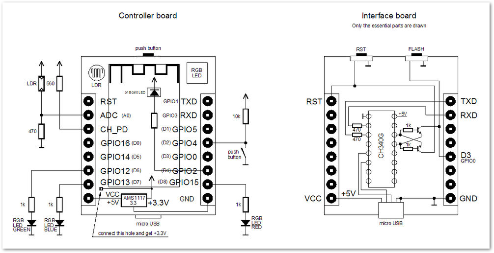

# Controller pinout of "witty cloud" board

## Schematic

## Pinout

GPIO    | Pin | build-in function  | using for          |
--------|-----|--------------------|--------------------|
GPIO 16 | D0  | -                  | I2C SDA |
GPIO 5  | D1  | -                  | I2C SCL |
GPIO 0  | D3  | Flash-Button       | Button Pump        |
GPIO 14 | D5  | -                  | Button Valve       |
(-)     |     |                    |                    |
(-)     |     |                    | Output Pump        |
(-)     |     |                    | Output Valve       |
(-)     |     |                    |                    |
GPIO 2  | D4  | Blue LED on module |                    |
GPIO 4  | D2  | Button             |                    |
(-)     |     |                    |                    |
GPIO 15 | D8  | RGB-LED red        |                    |
GPIO 12 | D6  | RGB-LED green      |                    |
GPIO 13 | D7  | RGB-LED blue       |                    |